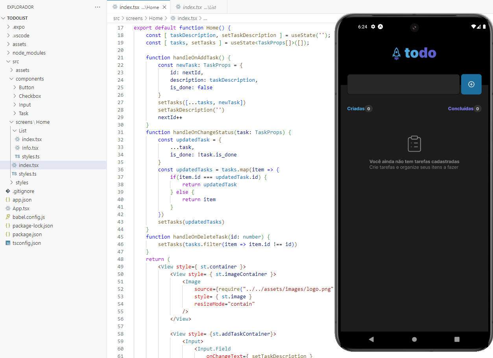
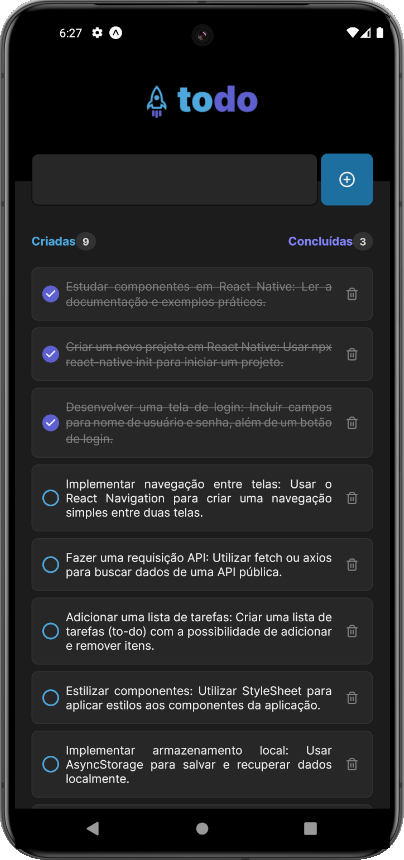
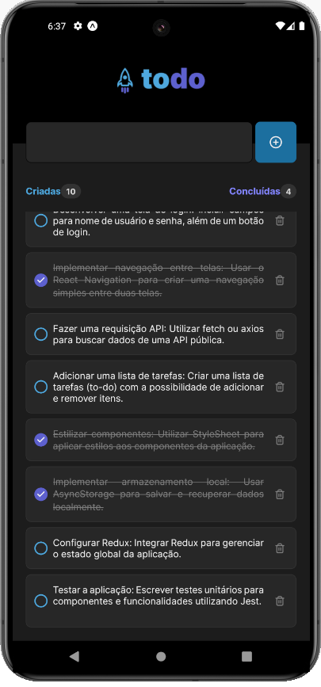

# ToDo App - RocketSeat React Native Challenge

Este é um projeto do Nível 1 da Trilha de React Native da [RocketSeat](https://www.rocketseat.com.br). O objetivo deste desafio é criar um aplicativo de lista de tarefas (ToDo) que permita aos usuários adicionar, marcar como concluídas e remover tarefas.

## Funcionalidades

- Adicionar novas tarefas
- Marcar tarefas como concluídas
- Remover uma tarefa da listagem
- Mostrar o progresso de conclusão das tarefass

## Capturas de Tela

### Tela Inicial

