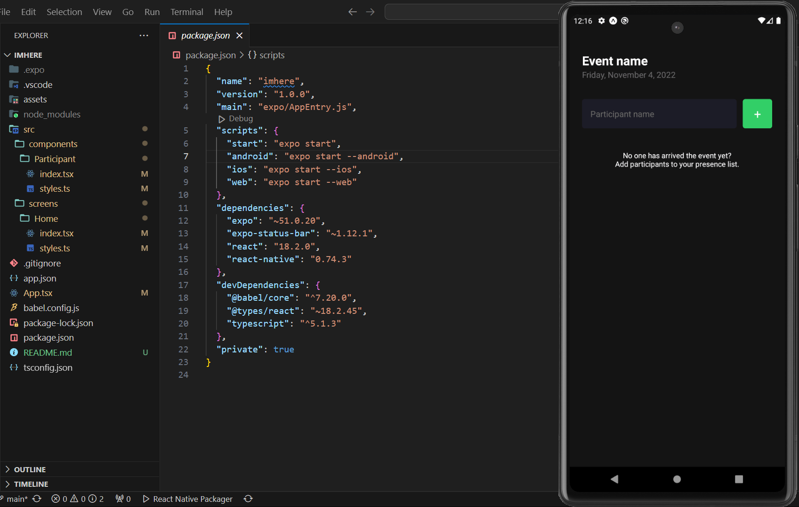

# Fundamentals - Class project

This project focuses on learning the fundamentals of React Native, including core concepts such as code structure, state management, interactivity, and implementing basic business rules.

The project is intentionally kept simple, utilizing only essential tools like **StyleSheet**, **Expo Go**, and **useState**.

## Features:
  - Add a new participant to the attendance list.
  - Remove a participant from the attendance list.

## Business rules:
  - Duplicate participant names are not allowed.

## Project Demonstration

