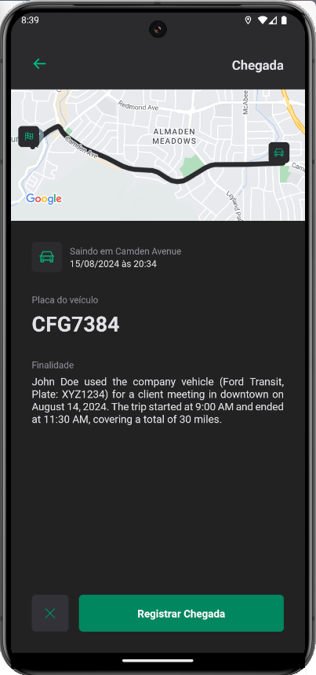

# Ignite Fleet

Este projeto é um gerenciador de frota de veículos desenvolvido em React Native, com funcionalidades de login social via Google, persistência de dados com RealmDB, geolocalização, mapas e suporte a operação offline-first. O objetivo do aplicativo é registrar o uso de veículos, incluindo informações como placa, finalidade, hora de partida, rota e chegada. Todos os dados são armazenados no Atlas DB utilizando o RealmDB.

## Funcionalidades

- **Login Social com Google:** Autenticação de usuários via conta Google.
- **Persistência de Dados com RealmDB:** Armazenamento de dados localmente com sincronização automática com o MongoDB Atlas.
- **Geolocalização e Mapas:** Registro de rotas utilizando geolocalização em tempo real e visualização da rota no mapa.
- **Offline First:** Suporte a operação offline, permitindo o uso do app mesmo sem conexão com a internet, com sincronização dos dados quando a conexão for restabelecida.

# Screenshots

