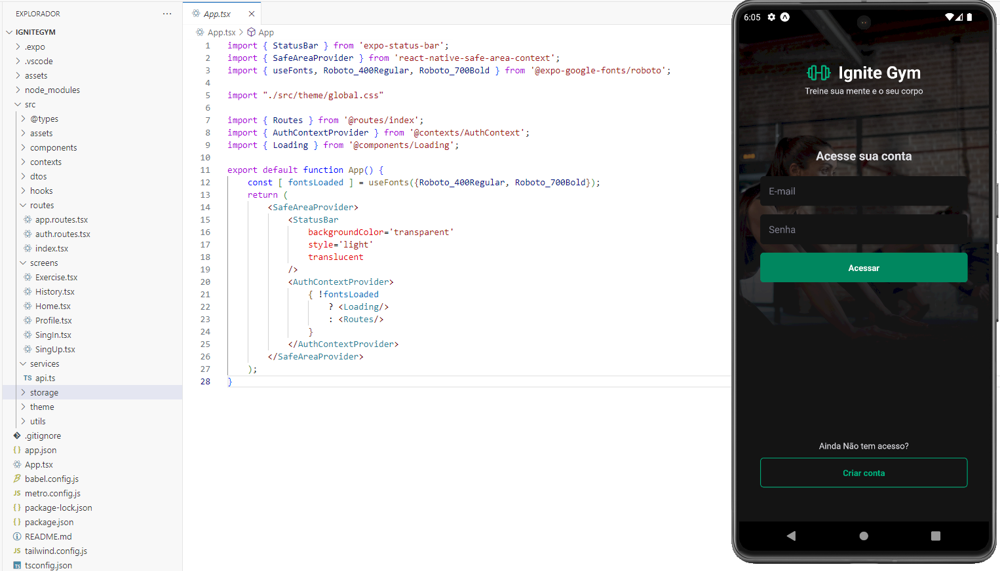
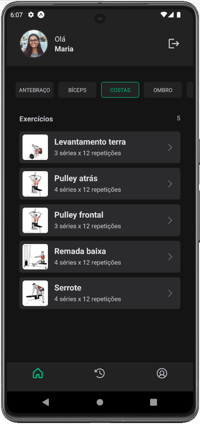
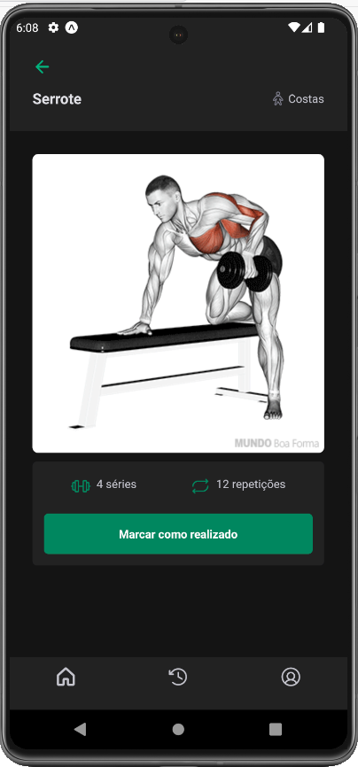
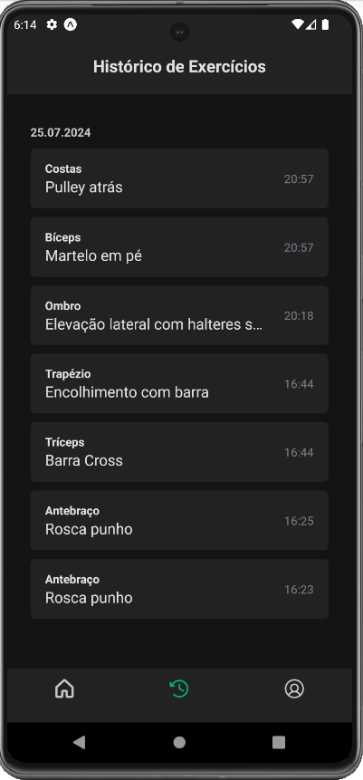
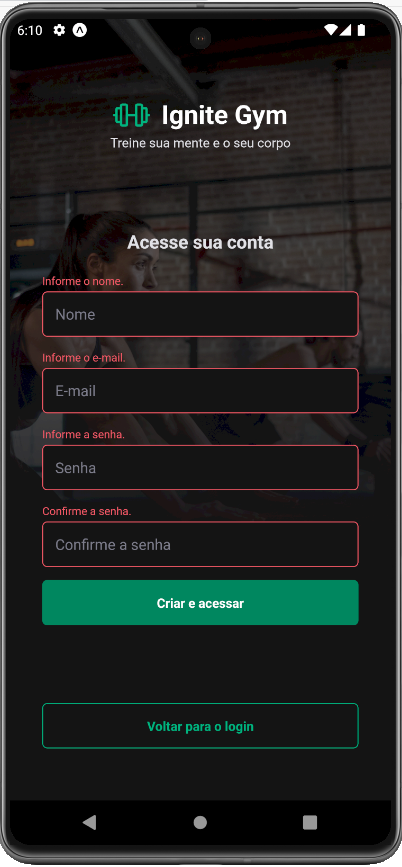

# Ignite Gym

Ignite Gym é um aplicativo para acompanhar e marcar os exercícios feitos. Ele possui funcionalidades de autenticação de usuário, atualização de perfil, integração com uma API que guarda as informações do usuário, tokens de acesso e refresh tokens, além de toasts para feedback ao usuário.

API do BackEnd: [IgniteGym API](https://github.com/orodrigogo/ignitegym-api)

## Funcionalidades

- Acesso e criação de conta
- Visualização e marcação de exercícios realizados
- Histórico de exercícios
- Atualização de perfil do usuário
- Feedback visual com toasts
- Integração com API para armazenamento de dados do usuário

## Tecnologias Utilizadas

- **NativeWind**: Biblioteca para estilização de componentes
- **React Navigation**: Navegação entre telas
- **Axios**: Cliente HTTP para integração com a API
- **Yup**: Validação de formulários
- **React Hook Form**: Gerenciamento de formulários
- **Async Storage**: Armazenamento de dados localmente

## Screenshots

### Feedback Toast

