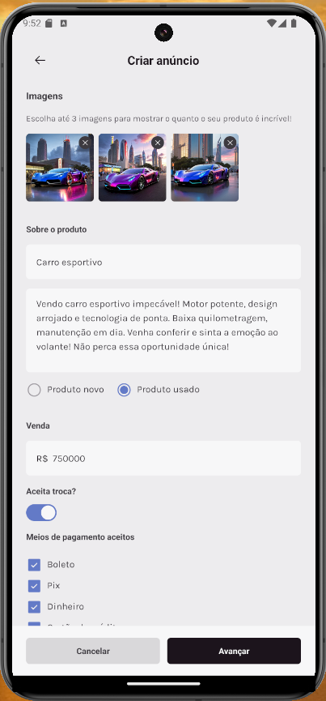

# Marketspace

## Descrição

Marketspace é uma aplicação de anúncios de produtos no estilo OLX, desenvolvida como parte do Desafio 03 da trilha de React Native da Rocketseat. A aplicação permite aos usuários cadastrar-se, fazer login, gerenciar produtos, listar produtos com busca e filtros, e enviar múltiplas imagens dos produtos.

API do BackEnd: [MarketSpace API](https://github.com/rocketseat-education/ignite-rn-2022-challenge-marketspace-api)

## Funcionalidades

- Cadastro de usuários
- Login de usuários
- Gerenciamento de produtos (criação, edição e exclusão)
- Listagem de produtos com busca e filtros
- Envio de múltiplas imagens para cada produto
- Contato com vendedores via WhatsApp

## Tecnologias Utilizadas

- **NativeWind**: Biblioteca para estilização de componentes
- **React Navigation**: Navegação entre telas
- **Axios**: Cliente HTTP para integração com a API
- **Async Storage**: Armazenamento de dados localmente

## Screenshots

