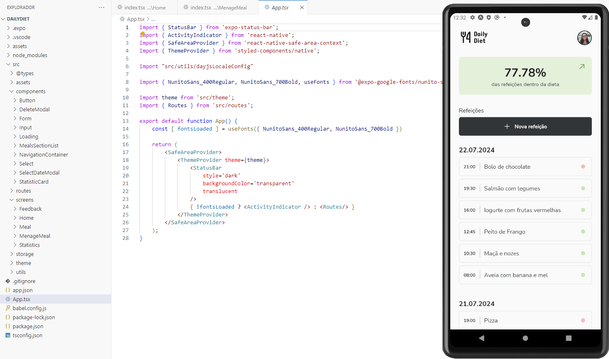

# Desafio: Daily Diet

Este desafio faz parte do curso de React Native da Rocketseat e tem como objetivo desenvolver uma aplicação de cadastro de refeições. A aplicação deve conter as seguintes funcionalidades:

- Adicionar uma nova refeição
- Editar uma refeição
- Remover uma refeição da listagem
- Mostrar as estatísticas do progresso da dieta
- Navegação entre telas em pilha
- Armazenamento local das refeições

## Funcionalidades

### 1. Adicionar uma nova refeição
Permite ao usuário adicionar uma nova refeição com informações como nome do prato, descrição, data, horário e se está dentro da dieta.

### 2. Editar uma refeição
Permite ao usuário editar as informações de uma refeição existente.

### 3. Remover uma refeição da listagem
Permite ao usuário remover uma refeição da listagem.

### 4. Mostrar as estatísticas do progresso da dieta
Mostra ao usuário as estatísticas do seu progresso, incluindo a porcentagem de refeições dentro da dieta, a melhor sequência de pratos dentro da dieta, e o total de refeições registradas.

### 5. Navegação entre telas em pilha
Utiliza navegação em pilha para permitir ao usuário navegar entre as diferentes telas da aplicação.

### 6. Armazenamento local das refeições
Armazena as refeições localmente no dispositivo do usuário, permitindo acesso offline às informações.

## Tecnologias Utilizadas

- React Native
- Expo
- Styled Components
- Async Storage
- React Navigation

## Telas

### Cadastrar refeição

### Tela inicial e Estatísticas

### Detalhes, Editar e Excluir da Refeição

