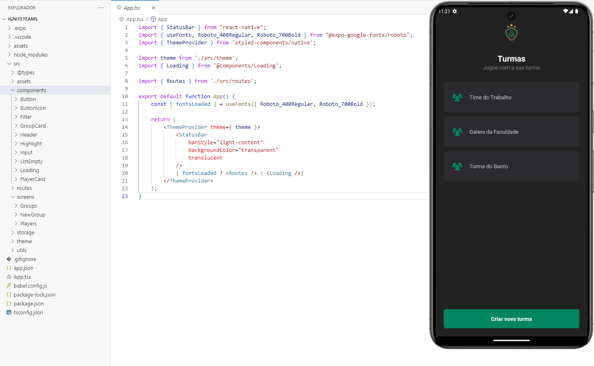
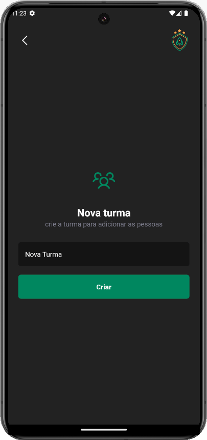
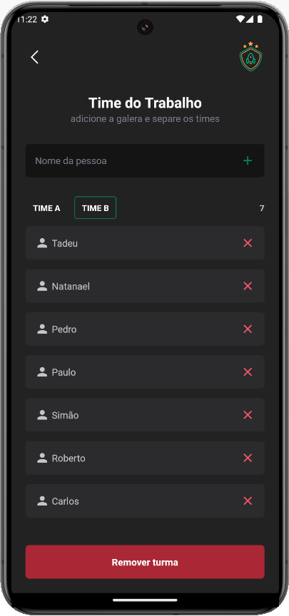

# Ignite Teams App

Ignite Teams é um aplicativo que permite a criação e gerenciamento de turmas e times. Dentro de cada turma, você pode cadastrar jogadores e separá-los em 'TIME A' e 'TIME B'. As informações são armazenadas localmente no dispositivo.

## Funcionalidades

- Criar Turma: Permite criar uma nova turma com um nome personalizado.
- Cadastrar Jogadores: Adicione jogadores dentro de uma turma específica e atribua-os a 'TIME A' ou 'TIME B'.
- Remover Jogadores: Remova jogadores individuais de uma turma.
- Remover Turma: Exclua uma turma inteira, incluindo todos os jogadores cadastrados nela.
- Armazenamento Local: Todas as informações são armazenadas no storage do celular, garantindo que os dados permaneçam disponíveis mesmo sem conexão com a internet.

## Tecnologias Utilizadas

- React Native: Framework para desenvolvimento mobile.
- Expo: Ferramenta para facilitar o desenvolvimento e execução do app.
- Styled Components: Biblioteca para estilização.
- ReactNavigation: Biblioteca de Navegação.

## Estrutura do Projeto

- assets: Recursos estáticos como imagens e fontes.
- components: Componentes reutilizáveis como Botão, Card de Jogador, Input, etc.
- routes: Configuração das rotas do aplicativo.
- screens: Telas do aplicativo, como Grupos, Novo Grupo, Jogadores.
- storage: Módulos para interação com o armazenamento local.
- theme: Configurações de tema e estilo.
- utils: Utilitários e funções auxiliares.

## Capturas de Tela

### Tela Inicial

### Cadastro de Time, Cadastro e Listagem de jogadores

## Créditos

Projeto desenvolvido durante as aulas da Trilha de React Native - Nível 2 da [Rocketseat](https://www.rocketseat.com.br), ministradas pelo educador Rodrigo Gonçalves.
